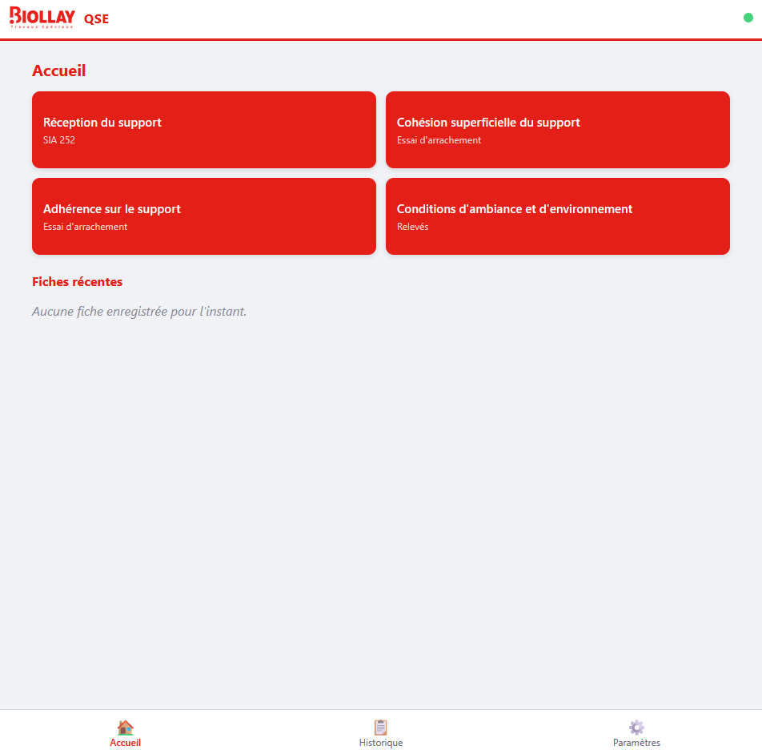
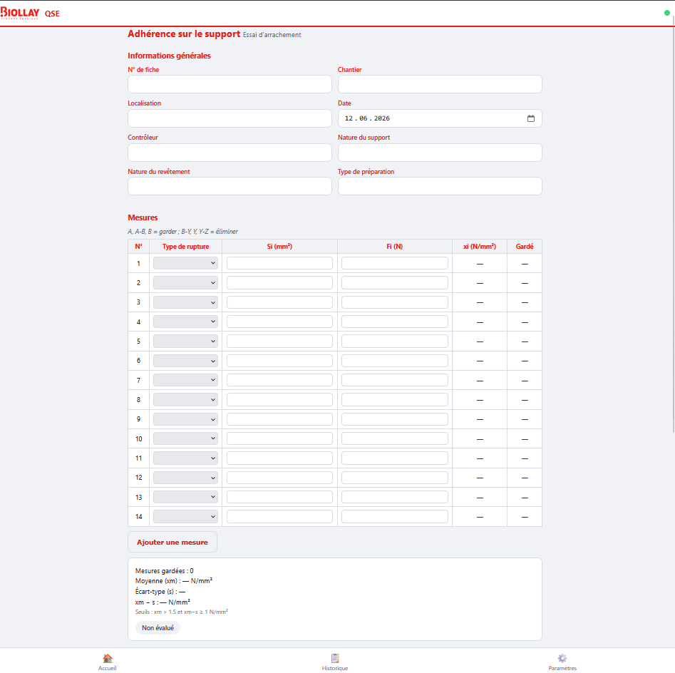
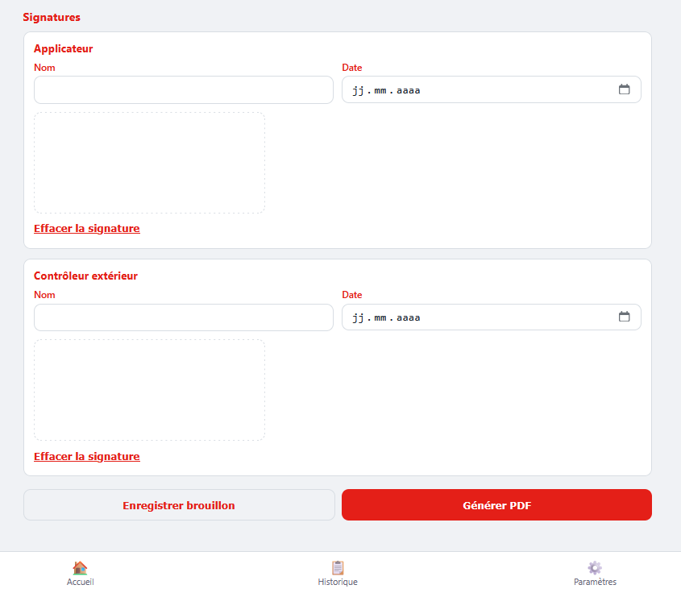
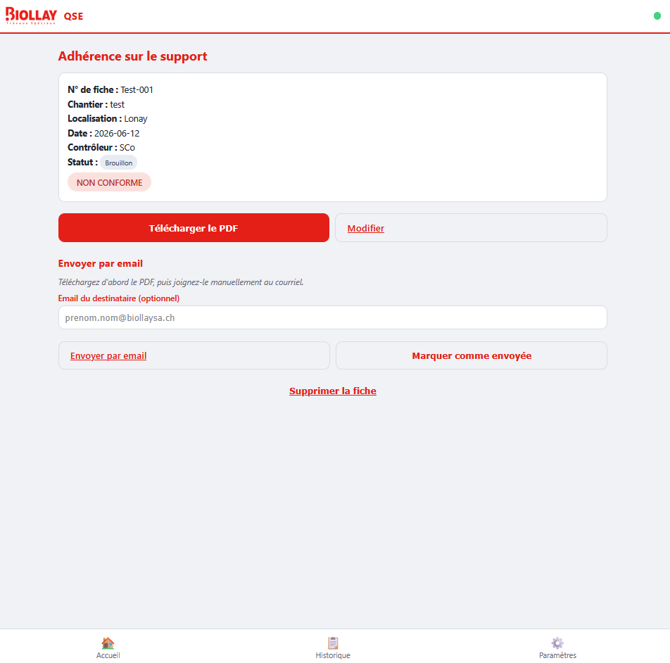
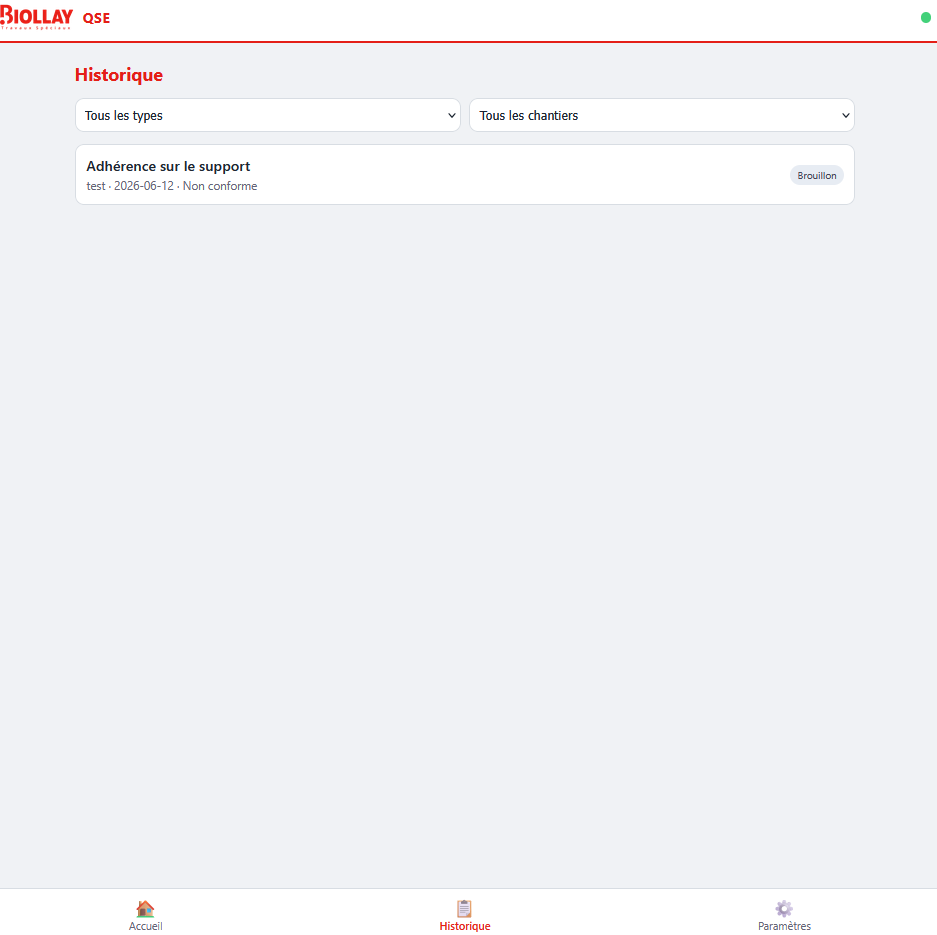
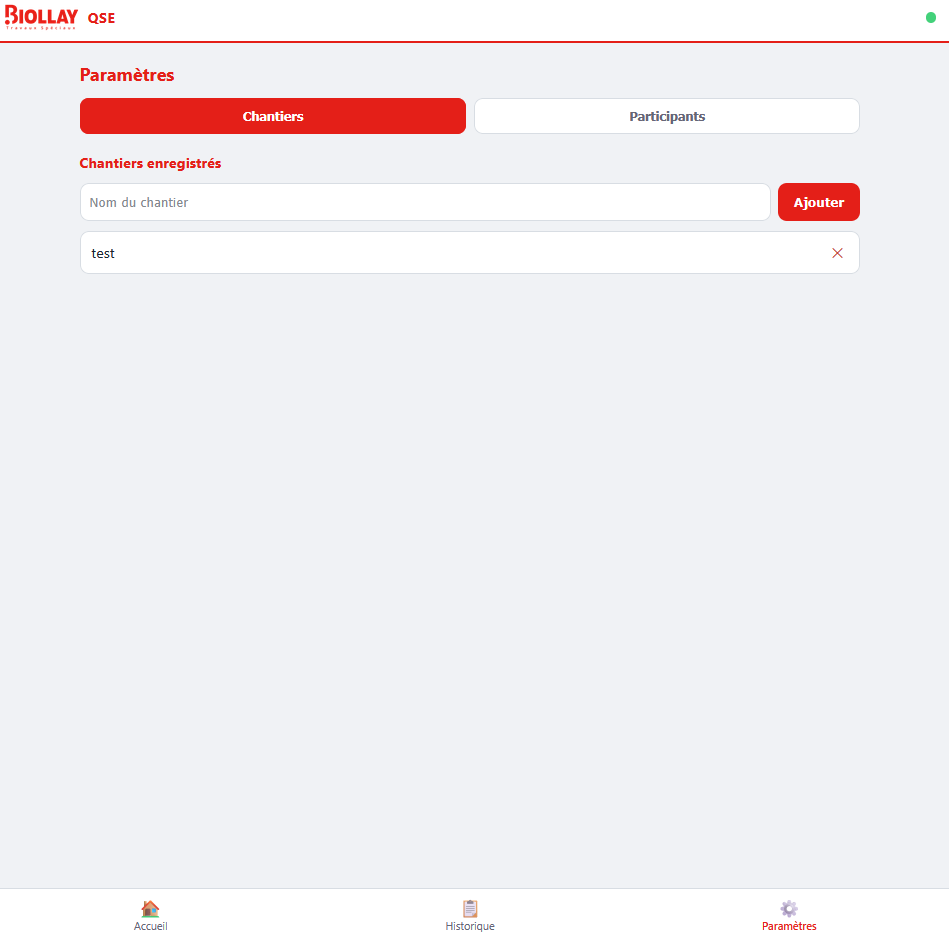

# QSE Biollay — Fiches de contrôle qualité (PWA hors-ligne)

Application web (PWA) pour Travaux Spéciaux Biollay SA, permettant de remplir sur
téléphone/tablette/ordinateur des **fiches de contrôle qualité** (réception du support,
cohésion, adhérence, conditions d'ambiance), de **signer** numériquement, de **générer un
PDF** et de l'**envoyer par email**. Fonctionne **100 % hors-ligne** une fois installée.

**Technique : aucun framework, aucune étape de build.** Que des fichiers `.html`, `.css`,
`.js` (modules ES) lisibles et modifiables directement.

> Un guide d'utilisation simplifié, destiné aux utilisateurs finaux (sans le contenu
> technique de ce README), est disponible en PDF :
> [docs/Guide_utilisateur_QSE_Biollay.pdf](docs/Guide_utilisateur_QSE_Biollay.pdf).

---

## Sommaire

1. [Captures d'écran](#captures-décran)
2. [Tester sur ordinateur (depuis le dépôt GitHub)](#tester-sur-ordinateur-depuis-le-dépôt-github)
3. [Déployer sur GitHub Pages](#déployer-sur-github-pages)
4. [Installer et utiliser sur téléphone / tablette](#installer-et-utiliser-sur-téléphone--tablette)
5. [Guide d'utilisation de l'application](#guide-dutilisation-de-lapplication)
6. [Critères de conformité appliqués](#critères-de-conformité-appliqués)
7. [Organisation du projet](#organisation-du-projet)
8. [Ajouter un nouveau type de fiche](#ajouter-un-nouveau-type-de-fiche)
9. [Tests](#tests)
10. [Charte graphique](#charte-graphique)

---

## Captures d'écran

| | |
|---|---|
|  |  |
| Accueil — boutons des 4 fiches, fiches récentes | Formulaire — en-tête, mesures, conformité en direct |
|  |  |
| Signature tactile | Consultation — résumé, PDF, email |
|  |  |
| Historique — filtres par type et chantier | Paramètres — chantiers / participants |

---

## Tester sur ordinateur (depuis le dépôt GitHub)

Deux façons de tester sur un ordinateur, sans rien installer de lourd :

### Option A — Ouvrir la version en ligne (après déploiement)

Une fois l'app déployée sur GitHub Pages (voir section suivante), il suffit d'ouvrir
l'URL publique dans un navigateur de bureau (Chrome, Edge, Firefox, Safari) :

```
https://wyrdasc.github.io/qse-biollay-pwa/
```

Tout fonctionne directement (formulaires, signature à la souris, génération PDF). C'est
la façon la plus simple de faire une démo ou de tester une mise à jour.

### Option B — Cloner le dépôt et lancer en local

Utile pour modifier le code et voir le résultat avant de le publier.

```bash
git clone https://github.com/wyrdaSC/qse-biollay-pwa.git
cd qse-biollay-pwa
node _devserver.cjs
```

puis ouvrir [http://localhost:8000](http://localhost:8000).

L'app utilise des modules ES et un service worker : elle doit être servie via
`http://`/`https://` (pas en ouvrant `index.html` directement avec `file://`). Le script
`_devserver.cjs` fourni ne demande aucune dépendance (juste Node.js, déjà nécessaire pour
beaucoup d'environnements de dev). Toute autre solution équivalente fonctionne aussi
(`npx serve .`, extension VS Code « Live Server », etc.).

---

## Déployer sur GitHub Pages

Le dépôt est déjà connecté à GitHub
(`https://github.com/wyrdaSC/qse-biollay-pwa`). Comme il n'y a **rien à compiler**, on
publie le dépôt tel quel :

1. Sur GitHub : **Settings → Pages**.
2. **Source** : *Deploy from a branch*.
3. **Branch** : `main`, dossier `/ (root)`.
4. **Save**. Après une minute ou deux, l'app est disponible sur
   `https://wyrdasc.github.io/qse-biollay-pwa/`.

Tous les chemins de l'app (`index.html`, `manifest.webmanifest`,
`service-worker.js`, imports JS) sont **relatifs** (`./...`), donc ça fonctionne
correctement même servi depuis un sous-dossier (`/qse-biollay-pwa/`). HTTPS est fourni
automatiquement par GitHub Pages — c'est une exigence du service worker (et donc du
mode hors-ligne et de l'installation sur téléphone).

**Mises à jour** : un simple `git push` sur `main` republie le site (pas de build).
Penser à **incrémenter `CACHE_VERSION`** dans `service-worker.js` (et ajouter les
nouveaux fichiers à `RESSOURCES` si besoin) à chaque changement de fichier — sinon les
appareils déjà installés continuent de servir l'ancienne version depuis leur cache
(voir aussi [Notes techniques](#charte-graphique) ci-dessous).

---

## Installer et utiliser sur téléphone / tablette

1. Sur le téléphone/tablette, ouvrir l'URL publique
   (`https://wyrdasc.github.io/qse-biollay-pwa/`) dans **Chrome** (Android) ou
   **Safari** (iOS/iPadOS).
2. **Installer l'app sur l'écran d'accueil** :
   - *Android / Chrome* : une bannière « Installer l'application sur cet appareil ? »
     apparaît directement dans l'app (ou menu ⋮ → « Ajouter à l'écran d'accueil »).
   - *iOS / iPadOS / Safari* : bouton Partager (carré avec flèche) → « Sur l'écran
     d'accueil ». (`beforeinstallprompt` n'existe pas sur Safari, donc pas de bannière —
     c'est normal.)
3. Ouvrir l'icône créée sur l'écran d'accueil : l'app se lance en plein écran, sans
   barre d'adresse, comme une app native.
4. **Premier lancement avec connexion obligatoire** (pour que le service worker mette
   tous les fichiers en cache) — ensuite, l'app fonctionne **entièrement hors-ligne** :
   remplissage de fiches, calculs de conformité, signature, sauvegarde, génération PDF.
   Seul l'envoi par email (`mailto:`) nécessite une connexion.
5. Le point en haut à droite de la barre indique l'état réseau (vert = en ligne,
   orange = hors-ligne).

---

## Guide d'utilisation de l'application

### Écran d'accueil

- Un bouton par type de fiche (Réception du support, Cohésion, Adhérence, Conditions
  d'ambiance) → ouvre un nouveau formulaire de ce type.
- Bandeau d'avertissement si des fiches ne sont pas encore marquées « Envoyée ».
- Liste des dernières fiches enregistrées, avec accès direct à leur consultation.

### Remplir une fiche

1. Depuis l'accueil, choisir le type de fiche souhaité.
2. Renseigner l'en-tête (N° de fiche, chantier, localisation, date, contrôleur, nature
   du support, etc.). Les champs « Chantier » et « Contrôleur » proposent une
   auto-complétion basée sur les chantiers/participants déjà saisis (voir
   [Paramètres](#paramètres)).
3. Remplir le tableau de mesures (essais d'arrachement, relevés d'ambiance, critères
   Oui/Non selon le type). Les calculs (xi, moyenne, écart-type, conformité) et les
   badges « Conforme » / « Non conforme » se mettent à jour **en temps réel** au fil de
   la saisie.
4. **Signer** : tracer la signature au doigt (téléphone/tablette) ou à la souris
   (ordinateur) dans la zone prévue. Un bouton permet d'effacer et de recommencer.
5. Deux actions en bas de page :
   - **Enregistrer brouillon** : sauvegarde la fiche localement (IndexedDB), modifiable
     plus tard.
   - **Générer le PDF** : calcule la conformité finale, enregistre la fiche et propose
     le téléchargement du PDF.

### Consultation d'une fiche

- Résumé des informations, badge de statut (Brouillon / Complet / Envoyée) et badge de
  conformité.
- **Télécharger le PDF** à tout moment.
- **Envoyer par email** : ouvre l'application email du téléphone/ordinateur avec un
  sujet et un message pré-remplis (le PDF doit être joint manuellement — limitation du
  `mailto:`, qui ne permet pas de joindre un fichier automatiquement). Indisponible
  hors-ligne.
- **Marquer comme envoyée** : à faire une fois le PDF transmis (par email ou autrement).
- **Modifier** ou **Supprimer** la fiche.

### Historique

Liste de toutes les fiches enregistrées, avec filtres par **type de fiche** et par
**chantier**.

### Paramètres

Deux onglets :
- **Chantiers** : liste des chantiers connus (alimentée automatiquement à chaque
  nouvelle fiche, ou ajoutée manuellement), avec suppression possible.
- **Participants** : liste des contrôleurs/signataires connus, même principe.

Ces listes servent uniquement à l'auto-complétion dans les formulaires.

---

## Critères de conformité appliqués

Le badge « Conforme » / « Non conforme » affiché sur chaque fiche (et dans le PDF généré)
est calculé automatiquement par [`js/calculations.js`](js/calculations.js) selon les
règles suivantes :

| Type de fiche | Règle de conformité appliquée |
|---|---|
| **Réception du support** (SIA 252) | Conforme si les 9 critères Oui/Non (Propre, Compact, Résistant aux chocs, Non fissuré, Exempt de laitance, Sec en surface, Teneur en eau (méthode CM), Résistance à l'arrachement ≥ 1.5 MPa, Rugosité) sont **tous à « Oui »**, **et** qu'aucune remontée d'humidité n'est signalée. |
| **Cohésion superficielle du support** (essai d'arrachement) | Pour chaque mesure : xi = Fi / Si (force / surface, en N/mm²). Seules les ruptures de type **A** sont conservées pour le calcul de la moyenne xm et de l'écart-type s. Conforme si **xm > 1.5 MPa** et **(xm − s) ≥ 1.0 MPa**. |
| **Adhérence sur le support** (essai d'arrachement) | Même méthode que la cohésion (xi = Fi / Si), mais les ruptures conservées sont **A, A-B et B**. Conforme si **xm > 1.5 MPa** et **(xm − s) ≥ 1.0 MPa**. |
| **Conditions d'ambiance et d'environnement** | Pour chaque relevé renseigné : Hs ≤ 4 %, Hr ≤ 75 %, T° air / support / produit comprises entre 10 °C et 30 °C, et **T° support ≥ T° point de rosée + 3 °C**. La fiche est conforme si **tous** les relevés renseignés respectent ces bornes. |

---

## Organisation du projet

```
application-qse-pwa/
├── index.html              # Page unique (SPA), barre du haut + zone #ecran + nav du bas
├── manifest.webmanifest    # Métadonnées PWA (nom, icônes, couleurs)
├── service-worker.js       # Cache hors-ligne (cache-first, versionné)
├── _devserver.cjs          # Serveur statique pour le dev local
├── css/style.css           # Toute la feuille de style (mobile-first)
├── icons/                  # Logo Biollay + icône PWA
├── vendor/jspdf.umd.min.js # jsPDF (vendé localement, pas de CDN)
├── tests/                  # Suite de tests JS pour calculations.js
└── js/
    ├── app.js              # Point d'entrée : routeur, indicateur réseau
    ├── router.js           # Routage par hash (#/...)
    ├── db.js                # Wrapper IndexedDB (fiches, chantiers, participants)
    ├── forms-def.js         # Définitions des 4 types de fiches (libellés, critères, seuils)
    ├── calculations.js      # Calculs et règles de conformité
    ├── signature.js         # Pad de signature tactile (canvas)
    ├── pdf.js                # Génération du PDF (jsPDF)
    ├── install.js            # Invite d'installation PWA (beforeinstallprompt)
    ├── util.js               # Aides partagées (échappement HTML, téléchargement)
    └── views/                # Un fichier par écran (accueil, formulaire, consultation,
                                # historique, paramètres)
```

---

## Ajouter un nouveau type de fiche

1. **`js/forms-def.js`** : ajouter une entrée dans `FORM_TYPES` (libellé, sous-titre) et
   les éventuels critères/colonnes/seuils spécifiques.
2. **`js/views/form.js`** : ajouter le rendu du corps spécifique à ce type (suivre le
   modèle des fonctions `corpsReception`, `corpsAmbiance`, etc.).
3. **`js/calculations.js`** : ajouter la fonction de calcul de conformité correspondante.
4. **`js/pdf.js`** : ajouter le rendu de ce type dans le PDF.

Le bouton du nouveau type apparaît automatiquement sur l'écran d'accueil (généré depuis
`FORM_TYPES`).

---

## Tests

`tests/test.html` charge `js/calculations.js` et exécute une suite d'assertions
(xi, moyenne, écart-type, conformité des 4 fiches) — l'ouvrir dans le navigateur
(via le serveur local ou la version en ligne, ex. `.../tests/test.html`) affiche
« X / X tests réussis ».

---

## Charte graphique

Couleur principale : rouge Biollay `#E41F18` (`--marque` dans `css/style.css`), repris du
logo `icons/logo-biollay.png` affiché dans la barre du haut.

**Note technique** : à chaque modification d'un fichier listé dans `RESSOURCES`
(`service-worker.js`), incrémenter `CACHE_VERSION` — sinon les appareils ayant déjà
installé l'app continuent de servir les anciens fichiers depuis leur cache hors-ligne.
